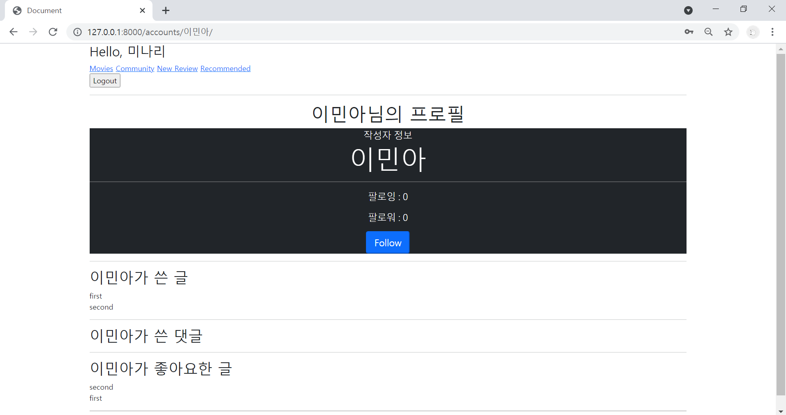
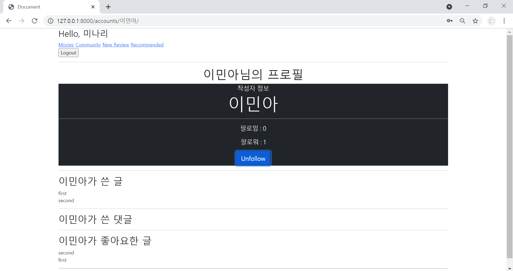
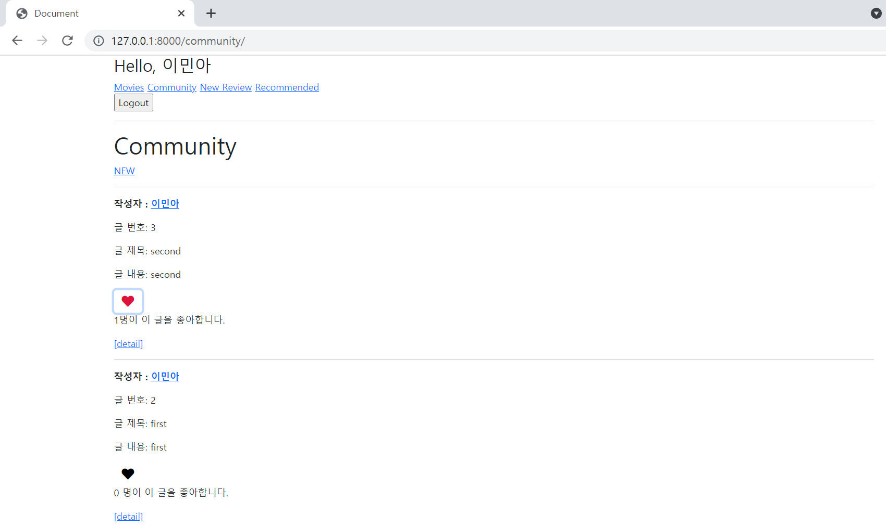
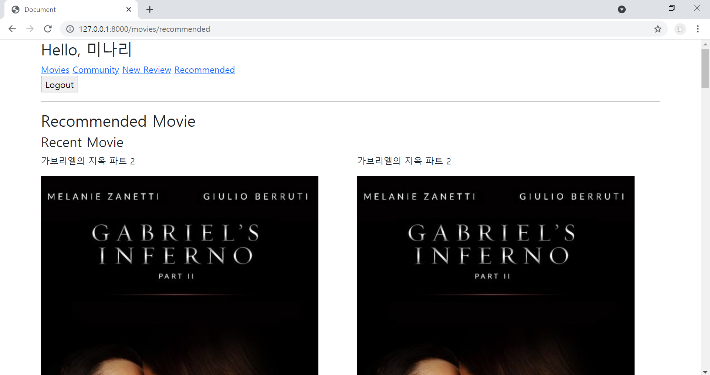

# Project_Django_AJAX

#### 서울 3반 이민아 21.05.07


> Driver : 서울 3반 강현구
>
> Navigator : 서울 3반 이민아


---

## Index


- [Image](#image)
- [팔로우 AJAX (accounts)](#팔로우-ajax)
- [좋아요 AJAX (community)](#좋아요-ajax)
- [추천 영화 (movies)](#추천-영화)


---

## Image


### 1. 팔로우 





### 2. 좋아요




### 3. 추천 영화




---

## 팔로우 AJAX 


### 1. accounts / templates / _follow.html

- form 태그 
  - 팔로우 버튼 제출 (`class="follow-form"` , `data-person-id="{{person.pk}}"`)
  - csrf_token : POST 방식

- button 태그 : 팔로우 / 팔로우 취소 (`id="follow-{{person.pk}}"`)

- p 태그 : 팔로워수  (`id="follow-count-{{person.pk}}"`)

- [_follow.html]

```html
<div class="jumbotron text-center text-white bg-dark">
  <p class="lead mb-1">작성자 정보</p>
  <h1 class="display-4">{{ person.username }}</h1>
  <hr>
    
  
    
    <p class="lead">
      팔로잉 : {{ followings|length }}
    </p>
    <p class="lead" id = "follow-count-{{ person.pk }}">
       팔로워 : {{ followers|length }}
    </p>
    
    <!-- 팔로우 버튼 -->
    
      <div>
        <form class ='follow-form' data-person-id = "{{ person.pk }}">
          
          
            <button class="btn-secondary btn-lg" role="button" id = "follow-{{ person.pk }}">Unfollow</button>
          
            <button class="btn-primary btn-lg" role="button"  id = "follow-{{ person.pk }}">Follow</button>
          
        </form>
      </div>
    
    
  
</div>
```


### 2. accounts / templates / profile.html

#### (1) block 

- ``

- [profile.html]

```javascript



<h1 class="text-center">{{ person.username }}님의 프로필</h1>



<hr>

<h2>{{ person.username }}가 쓴 글</h2>

  <div>{{ review.title }}</div>


<hr>

<h2>{{ person.username }}가 쓴 댓글</h2>

  <div>{{ comment.content }}</div>

 
<hr>

<h2>{{ person.username }}가 좋아요한 글</h2>

  <div>{{ review.title }}</div>


<hr>

<a href="">[back]</a>
```


#### (2) script

- axios CDN
- form태그 
  - class **선택(정의)**
  - csrf_token **정의**
  - addEventListener 함수
    - submit 기능 막기 (event.preventDefault())
    - person.pk **정의**

- axios 

  - method(post), url(person.pk), headers(csrf_token) **정의**

  - .then (성공하는 경우 함수)

    - const

      views.py의 JsonResponse 팔로우 여부 및 팔로워 수 **정의**

      **button태그 id 선택(정의)**

      **p태그 id 선택(정의)**

    - if

      button태그 팔로우 여부 조건 따라 내용 **변경**

      p태그 팔로워 수 내용 **변경**

- [profile.html]

```javascript
<script src="https://cdn.jsdelivr.net/npm/axios/dist/axios.min.js"></script>
<script>
  const form = document.querySelector('.follow-form')
  if (form) {
    const csrftoken = document.querySelector('[name=csrfmiddlewaretoken]').value
    form.addEventListener('submit',function (event) {
      event.preventDefault()
      const personId = event.target.dataset.personId
      

      axios({
        method : 'post',
        url : `http://127.0.0.1:8000/accounts/follow/${personId}/`,
        headers : { 'X-CSRFToken':csrftoken }
      })  
      .then(response => {
        const followed = response.data.followed                  
        const followers = response.data.followers
        const followBtn = document.querySelector(`#follow-${ personId }`)
        const followersCount = document.querySelector(`#follow-count-${ personId }`)
        
        if (followed) {
          followBtn.innerText='Unfollow'
        } else {
          followBtn.innerText = 'follow'
        }
        followersCount.innerText = `팔로워 : ${ followers } `
    

      })
        
    })
  }
  
</script>
```


### 3. accounts / views.py

- `followed` : 팔로우 여부(`True`, `False`)

- `followers_count` : 팔로워 명수(`person.followers.count()`)

- `JsonResponse(follow_status)` : `response.data` 추가 

- [views.py]

```python
from django.shortcuts import redirect, get_object_or_404
from django.contrib.auth import get_user_model
from django.views.decorators.http import require_POST
from django.http import JsonResponse

@require_POST
def follow(request, user_pk):
    if request.user.is_authenticated:
        person = get_object_or_404(get_user_model(), pk=user_pk)
        user = request.user
        if person != user:
            if person.followers.filter(pk=user.pk).exists():
                person.followers.remove(user)
                followed = False
            else:
                person.followers.add(user)
                followed = True

        follow_status = {
            'followed' : followed,
            'followers' : person.followers.count(),
        }
        return JsonResponse(follow_status)
    return redirect('accounts:profile',person.username)
```


---

## 좋아요 AJAX 


### 1. community / templates / index.html

#### (1) block

- form 태그 
  - 좋아요 버튼 제출 (`class="like-form"` , `data-review-id="{{review.pk}}"`)
  - csrf_token : POST 방식

- button 태그 : 좋아요 / 좋아요 취소 (`id="like-{{review.pk}}"`)

- p 태그 : 몇 명이 좋아합니다  (`id="like-count-{{review.pk}}"`)

- [index.html]

```html
<form class="d-inline like-form " data-review-id =  '{{ review.pk }}' >
  
  
    <button class="btn btn-link" >
      <i class="fas fa-heart fa-lg" style="color:crimson;" id= "like-{{ review.pk }}" ></i>
    </button>
  
    <button class="btn btn-link" >
      <i class="fas fa-heart fa-lg" style="color:black;" id= "like-{{ review.pk }}"></i>
    </button>
  
</form>
<p id = 'like-count-{{ review.pk }}'>
 {{ review.like_users.all|length }} 명이 이 글을 좋아합니다.
</p>  
```

#### (2) script

- axios CDN
- form태그 
  - class **선택(정의)**
  - **순회 (forEach)**
  - csrf_token **정의**
  - addEventListener 함수
    - submit 기능 막기 (event.preventDefault())
    - review.pk **정의**

- axios 

  - method(post), url(review.pk), headers(csrf_token) **정의**

  - .then (성공하는 경우 함수)

    - const

      views.py의 JsonResponse 좋아요 여부 및 좋아요 수 **정의**

      **button태그 id 선택(정의)**

      **p태그 id 선택(정의)**

    - if

      button태그 좋아요 상태 여부 조건 따라 내용 **변경**

      p태그 좋아요 수 내용 **변경**

  - .catch (실패하는 경우 함수)

    - location.href

      로그인 페이지로 이동

- [index.html]

```javascript
<script src="https://cdn.jsdelivr.net/npm/axios/dist/axios.min.js"></script>

<script>
    
const forms = document.querySelectorAll('.like-form')
const csrftoken = document.querySelector('[name=csrfmiddlewaretoken]').value
forms.forEach(form => {
  form.addEventListener('submit',function (event) {
    event.preventDefault()
    const reviewId = event.target.dataset.reviewId

    axios({
      method : 'post',
      url : `http://127.0.0.1:8000/community/${reviewId}/like/`,
      headers : { 'X-CSRFToken':csrftoken }
    })  
      
    .then(response => {

      const count = response.data.count
      const liked = response.data.liked

      const likeBtn = document.querySelector(`#like-${reviewId}`)
      const likeCount = document.querySelector(`#like-count-${reviewId}`)

      if (liked) {
        // likeBtn.style.color = crimson
        likeBtn.setAttribute('style','color: crimson ;' )
      } else {
        // likeBtn.style.color = crimson
        likeBtn.setAttribute('style','color: black ;' )
      }
      likeCount.innerText =`${count}명이 이 글을 좋아합니다.`

    })
      
    .catch(error => {
      if (error.response.status==401){
        location.href = "http://127.0.0.1:8000/accounts/login/"	
      }
    })
      
  })
})

</script>
```


### 2. community / views.py

- `liked` : 좋아요 여부(True, False)
- `count` : 좋아요 명수(review.like_users.count())
- `JsonResponse(like_status)` : `response.data` 추가 
- `HttpResponse(status=401)` : 인증되지 않은 사용자

- [views.py]

```python
from django.shortcuts import get_object_or_404
from django.views.decorators.http import require_POST
from django.http import JsonResponse, HttpResponse
from .models import Review

@require_POST
def like(request, review_pk):
    if request.user.is_authenticated:
        review = get_object_or_404(Review, pk=review_pk)
        user = request.user

        if review.like_users.filter(pk=user.pk).exists():
            review.like_users.remove(user)
            liked = False
        else:
            review.like_users.add(user)
            liked = True

        like_status = {
            'liked' : liked,
            'count' : review.like_users.count()
        }
        return JsonResponse(like_status)
    return HttpResponse(status=401)
```


---

## 추천 영화


### 1. movies / fixtures / movies.json

> python manage.py loaddata movies.json


### 2. movies / views.py

> 가장 최신 영화 10개
>
> 가장 오래된 영화 10개

- [views.py]

```python
from django.shortcuts import render
from django.views.decorators.http import require_GET
from .models import Movie

@require_GET
def recommended(request):
    recent_movies = Movie.objects.order_by('-release_date')[:10]
    old_movies = Movie.objects.order_by('release_date')[:10]
    
    context = {
        'recent_movies' : recent_movies,
        'old_movies' : old_movies
    }

    return render(request, 'movies/recommended.html', context)
```


### 3. movies / templates / recommended.html

- [recommended.html]

```python



<h3>Recommended Movie</h3>

<h4>Recent Movie</h4>
<div class="row">
  
    <div class="col-6">
      <p>{{ movie.title }}</p>
      
    </div>
  
</div>

<h4>Old Movie</h4>
<div class="row">
  
    <div class="col-6">
      <p>{{ movie.title }}</p>
      
    </div>
  
</div>

```


