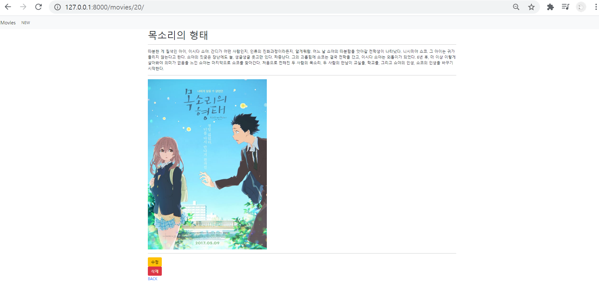
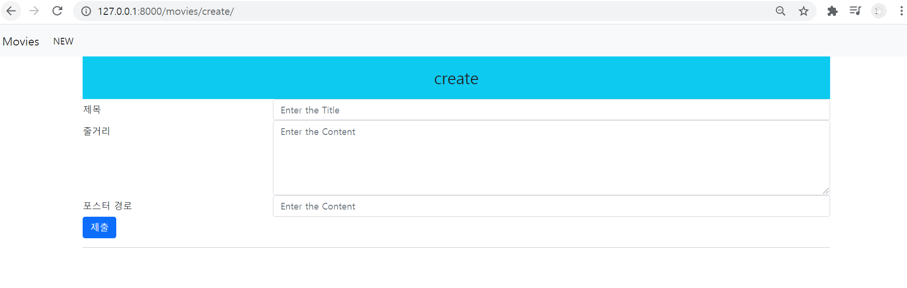
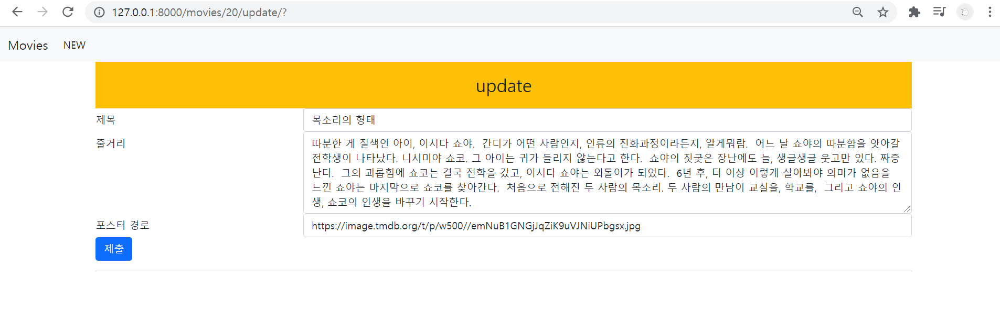
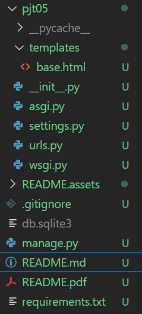
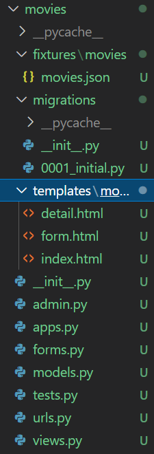

# 05_pjt05

#### 서울 3반 이민아 21.03.19


> Django


### 0. pair pjt

> navigator : 서울 3반 이민아
>
> driver : 서울 3반 정희진

### (1) git lab

> git lab maintainer 추가

###  (2) git bash

> `db.sqlite3`는 git pull하는 경우 보이지 않아서 문제 상황 발생
>
> movies.json에 없는 항목을 field명으로 추가하지 않도록 유의(created_at)

- [Terminal]

```python
git log 
# 동일 상태 확인

git push origin master
git commit -m "update"
# 작성한 사람

git pull origin master 
git clone 주소
# 받는 사람
# operational error (db.sqlite3는 그대로 전송이 안 됨, .gitignore)
# movies.json으로 데이터를 보여준다
```

### (3) data

> `pip install -r requirements.txt`
>
> `python manage.py dumpdata app.class`
>
> `python manage.py loaddata folder/name.json`
>
> `python manage.py migrate`

- [Terminal]

```python
pip install -r requirements.txt
# 버젼 조회 및 다운로드
# requirements.txt 조회 후 다운로드 및 설치

python manage.py migrate

python manage.py dumpdata movies.movie
# django-admin dumpdata app.class
# list안의 dictionary의 하나의 영화 정보 출력
# python manage.py dumpdata --indent 4 movies.movie
# 4칸 들여쓰기

python manage.py dumpdata movies.movie > movies.json
# movies.json 파일 생성 후 저장

python manage.py loaddata movies/movies.json
# fixtures/movies/movies.json 다운로드
# templates/movies/index.html
# templates/movies/new.html
# templates/movies/detail.html
```

### (4) migrate

> `python manage.py migrate` 

### (5) 명령어

> `django-admin startproject pjt05 `
>
> `python manage.py startapp movies`

- 프로젝트 생성 (pjt folder)
  - django-admin startproject crud .(crud와 manage.py 바로 생성)
  - django-admin startproject crud (crud/crud와 crud/manage.py 생성)
- app 생성 (app folder)
  - python manage.py startapp appname : app 생성
- 서버 연결 (web)
  - python manage.py runserver : 페이지 연결
- 버젼 (requirements.txt)
  - pip freeze > requirements.txt : 버젼 저장
  - pip install -r requirements.txt : 버젼 조회 및 다운로드
- 가상환경 (venv folder)
  - python -m venv venv  :  가상환경 폴더 생성
  - source venv/Scripts/activate : 가상환경 실행
  - deactivate : 가상환경 해제
  - pip list : 가상환경 설치된 목록 확인
- 설치 (settings.py)
  - pip install django : django 설치
  - pip install django-extensions : django-extensions 설치 **(settings.py)**
  - pip install Pillow : models.ImageField(blank=True) 이미지삽입 (models.py)
  - pip install django-bootstrap-v5 : 부트스트랩 설치 (부트스트랩 form.py) **(settings.py)**
  - pip install django-imagekit : 이미지 리사이즈 **(settings.py)**
- 관리자 (admin.py)
  - python manage.py createsuperuser : 관리자 계정 생성
- DB 동기화 (app/migrations, app/fixtures)
  - python manage.py makemigrations : migrations 폴더 아래 하위 파일 생성
  - python manage.py migrate : 실행할 때마다 명령어
  - python manage.py dumpdata articles.article > articles.json : fixtures  폴더 아래 articles.json으로 articles.article 정보 생성
  - python manage.py loaddata articles/articles.json : fixtures 폴더 아래 articles/articles.json db에 불러오기
  - python manage.py shell_plus : OOP 입력
- python select interpreter

### (6) 명세

> 프로젝트 이름은 pjt05, 앱 이름은 movies
>
> 모든 템플릿에서 상속받아 사용할 base.html을 작성 (프로젝트 및 앱 디렉토리와 동일한 위치에 생성, Bootstrap CDN을 포함)


### 1. virtual 

### (1) 가상환경 시작

> `python -m venv venv`

- [Terminal]

```python
python -m venv venv 
# (python.exe 실행 / -module / module명 / 폴더이름)
```

### (2) 설치된 목록 확인

> `Lib/site-packages/django`

- [Terminal]

```python
pip list
# site-packages 설치된 모든 목록
```

### (3) 가상화 실행

> `source venv/Scripts/activate`
>
> `deactivate`

- [Terminal]

```python
source venv/Scripts/activate
# 실행 상위폴덩/하위폴더명/실행
(venv)
# enter 이후 나타나는 메세지

pip list
# 설치된 목록 줄어든다

deactivate
# (venv)가 사라진다

pip list
# 설치된 목록 늘어난다
```

### (4) .gitignore 추가 

> `gitignore.io` python windows 등 검색
>
> `.gitignore` 생성 후 복사 붙이기 (`venv` , `db.sqlite` 포함)

- [.gitignore]

```python
### Django ###
*.log
*.pot
*.pyc
__pycache__/
local_settings.py
db.sqlite3
db.sqlite3-journal
media

# Environments
.env
.venv
env/
venv/
ENV/
env.bak/
venv.bak/
pythonenv*
```

### (5) django 가상환경

- [Terminal]

```python
python -m venv venv 
# (python.exe 실행 / -module / module명 / 폴더이름)

source venv/Scripts/activate
# 실행 상위폴덩/하위폴더명/실행

pip install django
# django 설치
pip install django-extensions
# django-extensions 설치

python manage.py shell_plus
# OOP 입력

django-admin startproject pjt05 .
# 프로젝트 설치
# django-admin startproject crud .(crud와 manage.py 바로 생성)
# django-admin startproject crud (crud/crud와 crud/manage.py 생성)

python -m pip freeze
# 버젼 확인 
# 현재 사용하는 라이브러리를 고정하고 저장 pip freeze(출력)

pip freeze > requirements.txt
# 버젼 저장
# requirements.txt 에 pip freeze 출력 결과 저장
# requirements.txt가 없어도 생성

pip install -r requirements.txt
# 버젼 조회 및 다운로드
# requirements.txt 조회 후 다운로드 및 설치

python manage.py startapp movies
# 앱 설치
```


### 2. pjt05 (pjt) 

### (1) urls.py

> `import include`
>
> `from django.conf import settings
> from django.conf.urls.static import static`
>
> `+ static(settings.MEDIA_URL, document_root = settings.MEDIA_ROOT)`

- [urls.py]

```python
from django.contrib import admin
from django.urls import path, include
from django.conf import settings
from django.conf.urls.static import static

urlpatterns = [
    path('admin/', admin.site.urls),
    path('movies/', include('movies.urls'))
] + static(settings.MEDIA_URL, document_root = settings.MEDIA_ROOT)
```


### (2) settings.py 

> `INSTALLED_APPS`  앱 등록
>
> `LANGUAGE_CODE` 언어 설정
>
> `TIME_ZONE` 시간 설정
>
> `TEMPLATES` templates DIRS 설정
>
> `STATIC_URL`
>
> `STATICFILES_DIRS` BASE_DIR static 설정
>
> `MEDIA_ROOT` BASE_DIR media 설정
>
> `MEDIA_URL`

- [settings.py]

```python
INSTALLED_APPS = [
    'movies',
    'django_extensions',
    'bootstrap5',
    'imagekit',
    'django.contrib.admin',
    'django.contrib.auth',
    'django.contrib.contenttypes',
    'django.contrib.sessions',
    'django.contrib.messages',
    'django.contrib.staticfiles',
]

TEMPLATES = [
    {
        'BACKEND': 'django.template.backends.django.DjangoTemplates',
        'DIRS': [BASE_DIR / 'pjt05' / 'templates'],
        'APP_DIRS': True,
        'OPTIONS': {
            'context_processors': [
                'django.template.context_processors.debug',
                'django.template.context_processors.request',
                'django.contrib.auth.context_processors.auth',
                'django.contrib.messages.context_processors.messages',
            ],
        },
    },
]

LANGUAGE_CODE = 'ko-kr'

TIME_ZONE = 'Asia/Seoul'

STATIC_URL = '/static/'
STATICFILES_DIRS = [
    BASE_DIR / 'pjt05' / 'static',
]

MEDIA_ROOT = BASE_DIR / 'media'
MEDIA_URL = '/media/'
```


### (3) templates/base.html

> CDN : `<link>` `<script>` / `` `` ``
>
> css 상속 : `  `
>
> nav태그 : `<nav></nav>`
>
> a태그 : Movies(index) 혹은 New 버튼(create) 클릭시 url 이동
>
> 다른 폴더 templates 상속 (div태그) : ` <div class="container"></div>` ``
>
> 동일 폴더 templates 상속 (include) : `` ``

- [base.html]

```python


<!DOCTYPE html>
<html lang="en">
<head>
  <meta charset="UTF-8">
  <meta http-equiv="X-UA-Compatible" content="IE=edge">
  <meta name="viewport" content="width=device-width, initial-scale=1.0">
  
  
  
  <title>Document</title>
</head>
<body>
  <nav class="navbar navbar-expand-lg navbar-light bg-light">
    <div class="container-fluid">
      <a class="navbar-brand" href="">Movies</a>
      <button class="navbar-toggler" type="button" data-bs-toggle="collapse" data-bs-target="#navbarSupportedContent" aria-controls="navbarSupportedContent" aria-expanded="false" aria-label="Toggle navigation">
        <span class="navbar-toggler-icon"></span>
      </button>
      <div class="collapse navbar-collapse" id="navbarSupportedContent">
        <ul class="navbar-nav me-auto mb-2 mb-lg-0">
          <li class="nav-item">
            <a class="nav-link active" aria-current="page" href="">NEW</a>
          </li>
        </ul>
      </div>
  </nav>

  <div class="container">
    
    
  </div>

  

</body>
</html>
```


### (4) static/stylesheets/style.css

- [style.css]

```python
# 생략
```


### 3. movies (app)

### (1) urls.py

- [urls.py]

```python
from django.urls import path
from . import views

app_name = 'movies'
urlpatterns = [
    path('', views.index, name='index'),
    path('create/', views.create, name='create'),
    path('<int:pk>/', views.detail, name='detail'),
    path('<int:pk>/update/', views.update, name='update'),
    path('<int:pk>/delete/', views.delete, name='delete'),
]
```


### (2) fixtures/movies/movies.json

- [movies.json]

```python
# python manage.py makemigrations
# python manage.py migrate
# python manage.py loaddata movies/movies.json
```


### (3) models.py

> `def __str__(self):` : 제목을 용이하게 보기 위한 함수 추가
>
> `python manage.py makemigrations`
>
> `python manage.py migrate`

- [models.py]

```python
from django.db import models
# from imagekit.models import ImageSpecField
# from imagekit.processors import ResizeToFill
# from imagekit.models import ProcessedImageField
# img 규격화를 위한 import 

class Movie(models.Model):
    title = models.CharField(max_length=100)
    overview = models.TextField()
    poster_path = models.CharField(max_length=500)

    def __str__(self):
        return self.title
    
# python manage.py makemigrations
# python manage.py migrate
```


### (4) views.py (view decorator)

> 오류, url 이동, html 이동 : `import render, redirect, get_object_or_404`
>
> view decorator : `from django.views.decorators.http import require_safe, require_http_methods, require_POST`
>
> models.py : `from .models import Movie`
>
> forms.py : `from .forms import MovieForm`

- [views.py]

```python
from django.shortcuts import render, redirect, get_object_or_404
from django.views.decorators.http import require_safe, require_http_methods, require_POST
from .models import Movie
from .forms import MovieForm

@require_safe
# view decorator
def index(request):
# 전체 조회
    movies = Movie.objects.order_by('-pk')
    # 역순
    context = {
        'movies': movies,
    }
    return render(request, 'movies/index.html', context)

@require_http_methods(['GET', 'POST'])
# view decorator list
def create(request):
    if request.method == 'POST':
    # create forms.py form태그 method POST
        form = MovieForm(request.POST, request.FILES)
        # instance 생성
        # form method request.POST
        # static files request.FILES
        if form.is_valid():
        # 유효성 검사
            movie = form.save()
            # 저장
            return redirect('movies:detail', movie.pk)
    else:
    # new index.html a태그 GET 방식
        form = MovieForm()
        # instance 생성
    context = {
        'form': form,
    }
    return render(request, 'movies/form.html', context)
	# form.html로 create.html과 update.html 통합

@require_safe
# view decorator
def detail(request, pk):
    movie = get_object_or_404(Movie, pk=pk)
    # import get_object_or_404
    # get_object_or_404(Model, pk=pk)
    context = {
        'movie': movie,
    }
    return render(request, 'movies/detail.html', context)
    
@require_POST
# view decorator
def delete(request, pk):
    movie = get_object_or_404(Movie, pk=pk)
    # import get_object_or_404
    # get_object_or_404(Model, pk=pk)
    movie.delete()
    return redirect('movies:index')

@require_http_methods(['GET', 'POST'])
# view decorator list
def update(request, pk):
    movie = get_object_or_404(Movie, pk=pk)
    # import get_object_or_404
    # get_object_or_404(Model, pk=pk)
    if request.method == 'POST':
    # update forms.py form태그 method POST
        form = MovieForm(request.POST, request.FILES, instance=movie)
        # instance 호출 movie
        # form method request.POST
        # static files request.FILES
        if form.is_valid():
            form.save()
            return redirect('movies:detail', movie.pk)
    else:
    # edit detail.html form태그 GET 방식(a태그도 가능)
        form = MovieForm(instance=movie)
        # instance 호출 movie
    context = {
        'form': form,
        'movie': movie,
        # pk를 가져오기 위해 추가 movie
    }
    return render(request, 'movies/form.html', context)
	# form.html로 create.html과 update.html 통합
```


### (5) templates/movies

> views.py : if, else
>
> forms.py : form태그 (POST - `create, update`) 
>
> html : a태그(GET - `new`), form태그(GET - `edit`, POST - `delete`)

- [index.html]

```python


# 부트스트랩



  <h1>INDEX</h1>

  <a href="" class="text-decoration-none">NEW</a>
  # GET 방식 NEW
    
  <div class="row row-cols-1 row-cols-md-3 g-4">
  
  
    <div class="col">
      <div class="card">
        
        # img 경로에서 이미지를 보여주기 위한 img태그
        <div class="card-body">
          <a href="" class="card-title">{{ movie.title }}</a>
          # title을 클릭하면 detail로 이동하는 a태그
        </div>
      </div>
    </div>
  
      
  </div>
  

```

- [detail.html]

```python


# 부트스트랩



  <h1>{{ movie.title }}</h1>
  <hr>
  <p>{{ movie.overview }}</p>
  <hr>
  
  # img 경로에서 이미지를 보여주기 위한 img태그
  <hr>

  <form action="">
    <button class="btn btn-warning">수정</button>
  </form>
  # GET 방식 EDIT
    
  <form action="" method="POST">
    
    <button class="btn btn-danger">삭제</button>
  </form>
  # POST 방식 DELETE

  <a href="" class="text-decoration-none">BACK</a>


```

- [form.html]

```python


# 부트스트랩


  
  # request.resolver_match의 정보 경로들 중 url_name이 create인 경우
    <div class = "fs-3 text-center bg-info p-3">create</div>
  
  # request.resolver_match의 정보 경로들 중 url_name이 update인 경우
	<div class = "fs-3 text-center bg-warning p-3">update</div>
  

  <form action="" method="POST" enctype="multipart/form-data">
  # POST 방식 create update
    
    
    <input class="btn btn-primary" type="submit">
  </form>

  <hr>

```


### (6) forms.py (forms.ModelForm)

> models.py : `from .models import Movie` `class MovieForm(forms.ModelForm):` `class Meta:`
>
> 입력 : `forms.CharField()`
>
> 라벨 : `label`
>
> 너비 길이 등 속성 : `widget = forms.TextInput( attrs = {} )`
>
> 에러메세지 : `error_messages={'required': '제목은 필수 항목입니다',},`

- [forms.py]

```python
from django import forms
from .models import Movie

class MovieForm(forms.ModelForm):
    title = forms.CharField(
        label='제목',
        widget=forms.TextInput(
            attrs={
                'class': 'my-title form-control',
                'placeholder': 'Enter the Title',
                'maxlength': 100,
            }
        ),
        error_messages={
            'required': '제목은 필수 항목입니다',
        },
    )
    overview = forms.CharField(
        label='줄거리',
        widget=forms.Textarea(
            attrs={
                'class': 'my-content form-control',
                'placeholder': 'Enter the Content',
                'rows': 5,
                'cols': 30,
            }
        ),
        error_messages={
            'required': '줄거리는 필수 항목입니다',
        },
    )
    poster_path = forms.CharField(
        label='포스터 경로',
        widget=forms.TextInput(
            attrs={
                'class': 'my-content form-control',
                'placeholder': 'Enter the Content',
                'maxlength': 500,
            }
        ),
        error_messages={
            'required': '포스터 경로는 필수 항목입니다',
        },
    )

    class Meta:
        model = Movie
        fields = '__all__'
```


### (7) static/articles/image

> `pip install Pillow` : models.ImageField(blank=True) 이미지삽입 (models.py)
>
> ``
>
> `<form>` `enctype="multipart/form-data"`
>
> `<input>` ` accept="image/*"`


### (8) media 


### (9) imagekit

> `pip install Pillow` : models.ImageField(blank=True) 이미지삽입 (models.py)
>
> `pip install django-imagekit` : 이미지 리사이즈 **(settings.py)**
>
> `ImageSpecField` CACHE/images/8k/ 썸네일 새롭게 폴더 생성 후 자동 저장 (db에서 확인할 수 없다 원본 데이터를 그 순간 규격을 새롭게 보여주는 것)
>
> `ProcessedImageField` media / image 새롭게 폴더 생성 후 자동 저장 (db에서 확인할 수 있다)

- [card.html]

```python
# 생략
```


### (10) admin.py

- [admin.py]

```python
from django.contrib import admin
from .models import Movie
 
admin.site.register(Movie)

# 아이디 admin
# 비밀번로 123456
```


### 4. 결과 

### (1) index


### (2) detail



### (3) create



### (4) update

### 


### (5) pjt05



### (6) movies



### 5. 소감

> 지난번 첫 페어 프로젝트와 다르게 여성분과 페어하면서 편한 점이 존재했다. 더 섬세한 희진님의 관찰력에 감탄했고, 서로 오타가 없는지 검토하는 과정도 피드백이 잘 되어서 좋았다. 페어 프로젝트는 많은 분량의 코딩을 스스로 검토하기 어려울 때 피드백을 주고 즉석에서 토의하며 코딩을 작성한다는 점이 가장 큰 장점으로 느껴진다. 


