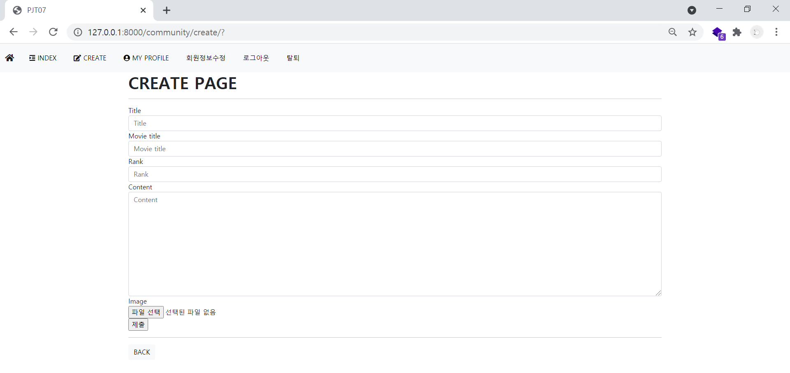

# pjt07

#### 서울 3반 이민아 21.04.02


> **Django**
>
> COMMUNITY CRUD(create, index, update, delete, **like)**
>
> COMMENT CR**(comments_create, comments_delete)**
>
> AUTHENTIFICATION CRUD(signup, login, logout, update, delete, password, **profile, follow)**


### 0. pair pjt

> navigator : 서울 3반 이민아
>
> driver : 서울 3반 정희진

### (1) git lab

> git lab maintainer 추가

###  (2) git bash

- [Terminal]

```python
git log --oneline 
# 동일 상태 확인

git push origin master
git commit -m "update"
# 작성한 사람

git pull origin master 
git clone 주소
# 받는 사람
# operational error (db.sqlite3는 그대로 전송이 안 됨, .gitignore)
# movies.json으로 데이터를 보여준다
```

### (3) data

> `pip install -r requirements.txt`
>
> `python manage.py migrate`

- [Terminal]

```python
pip install -r requirements.txt
# 버젼 조회 및 다운로드
# requirements.txt 조회 후 다운로드 및 설치

python manage.py migrate
```

### (4) 명령어

> `django-admin startproject pjt07 `
>
> `python manage.py startapp community`
>
> `python manage.py startapp accounts`

- 프로젝트 생성 (pjt folder)
  - django-admin startproject pjt07 .(pjt07와 manage.py 바로 생성)
  - django-admin startproject pjt07(pjt07와 pjt07/manage.py 생성)
- app 생성 (app folder)
  
  - python manage.py startapp appname : app 생성
- 서버 연결 (web)
  
  - python manage.py runserver : 페이지 연결
- 버젼 (requirements.txt)
  - pip freeze > requirements.txt : 버젼 저장
  - pip install -r requirements.txt : 버젼 조회 및 다운로드
- 가상환경 (venv folder)
  - python -m venv venv  :  가상환경 폴더 생성
  - source venv/Scripts/activate : 가상환경 실행
  - deactivate : 가상환경 해제
  - pip list : 가상환경 설치된 목록 확인
- 설치 (settings.py)
  - pip install django : django 설치
  
  - pip install django-extensions : django-extensions 설치 (settings.py)
  
    - `'django_extensions',` (settings.py)
  
  - pip install Pillow : 이미지삽입 (models.py/views.py)
  
    - `models.ImageField(blank=True)`  (models.py)
  
    - `` (html)
    - `<form>` `enctype="multipart/form-data"` (html)
    - `<input>` ` accept="image/*"` (html)
    - `request.FILES` (views.py)
  
  - pip install django-bootstrap-v5 : 부트스트랩 설치 (settings.py)
  
    - `'bootstrap5',` (settings.py)
    - `` (html)
  
  - pip install django-allauth : 소셜 로그인 설치  (settings.py/urls.py)
  
    - `'django.contrib.sites',`
  
    - `  'allauth',`
  
    - `'allauth.account',`
  
    - ` 'allauth.socialaccount',`
  
    - ` 'allauth.socialaccount.providers.google',` 
  
    - `SITE_ID = 1` (settings.py)
  
    - `path('accounts/', include('allauth.urls')),` (urls.py)
  
    - `` (login.html)
  
  - pip install django-imagekit : 이미지 리사이즈 (settings.py/models.py)
  
    - `'imagekit',` (settings.py)
  
    - `ImageSpecField` CACHE/images/8k/ 썸네일 새롭게 폴더 생성 후 자동 저장 (db에서 확인할 수 없다 원본 데이터를 그 순간 규격을 새롭게 보여주는 것) (models.py)
    - `ProcessedImageField` media / image 새롭게 폴더 생성 후 자동 저장 (db에서 확인할 수 있다) (models.py)
  
  - pip install django-bootstrap-pagination : 페이지목록 부트스트랩   (settings.py)
  
    - `'bootstrap_pagination',` (settings.py)
    - ` ` (index.html)
    - `` (index.html)
  
  - humanize
  
    - `'django.contrib.humanize',`  (settings.py)
    - `` (html)
- 관리자 (admin.py)
  
  - python manage.py createsuperuser : 관리자 계정 생성
- DB 동기화 (app/migrations, app/fixtures)
  - python manage.py makemigrations : migrations 폴더 아래 하위 파일 생성
  - python manage.py migrate : 실행할 때마다 명령어
  - python manage.py dumpdata articles.article > articles.json : fixtures  폴더 아래 articles.json으로 articles.article 정보 생성
  - python manage.py loaddata articles/articles.json : fixtures 폴더 아래 articles/articles.json db에 불러오기
  - python manage.py shell_plus : OOP 입력
- 단축키
  - Ctrl + [ or ] -> 들여쓰기, 내어쓰기
  - Alt + <방향키> -> 해당 커서에 있는 행 내용을 위아래로 이동
  - Ctrl + Alt + 위/아래 화살표 -> 위아래로 커서를 늘려서 동시에 여러줄 수정할 수 있도록 하는 기능
  - CTRL + D 해당 단어 동시 수정
  - ALT + CLICK  모두 한번에 잡아줘 수정하고싶은 부분들을 한번에 수정
  - ALT + Shift + ↓or↑ 현재 커서가 있는 줄을 복사하여 아래에 붙여넣어준다


### 1. virtual 

### (1) 가상환경 시작

> `python -m venv venv`

- [Terminal]

```python
python -m venv venv 
# (python.exe 실행 / -module / module명 / 폴더이름)
```

### (2) 설치된 목록 확인

> `Lib/site-packages/django`

- [Terminal]

```python
pip list
# site-packages 설치된 모든 목록
```

### (3) 가상화 실행

> `source venv/Scripts/activate`
>
> `deactivate`

- [Terminal]

```python
source venv/Scripts/activate
# 실행 상위폴덩/하위폴더명/실행
(venv)
# enter 이후 나타나는 메세지

pip list
# 설치된 목록 줄어든다

deactivate
# (venv)가 사라진다

pip list
# 설치된 목록 늘어난다
```

### (4) .gitignore 추가 

> `gitignore.io` python windows 등 검색
>
> `.gitignore` 생성 후 복사 붙이기 (`venv` , `db.sqlite` 포함)

- [.gitignore]

```python
### Django ###
*.log
*.pot
*.pyc
__pycache__/
local_settings.py
db.sqlite3
db.sqlite3-journal
media

# Environments
.env
.venv
env/
venv/
ENV/
env.bak/
venv.bak/
pythonenv*
```

### (5) django 가상환경

- [Terminal]

```python
python -m venv venv 
# (python.exe 실행 / -module / module명 / 폴더이름)

source venv/Scripts/activate
# 실행 상위폴덩/하위폴더명/실행

pip install django
# django 설치
pip install django-extensions
# django-extensions 설치
pip install django-bootstrap-v5
# bootstrap5 설치
pip install Pillow
# ImageField
pip install django-imagekit
# ProcessedImageField
pip install django-allauth
# social login
pip install django-bootstrap-pagination
# pagination
python manage.py shell_plus
# OOP 입력

django-admin startproject pjt07 .
# 프로젝트 설치
# django-admin startproject crud .(crud와 manage.py 바로 생성)
# django-admin startproject crud (crud/crud와 crud/manage.py 생성)

python -m pip freeze
# 버젼 확인 
# 현재 사용하는 라이브러리를 고정하고 저장 pip freeze(출력)

pip freeze > requirements.txt
# 버젼 저장
# requirements.txt 에 pip freeze 출력 결과 저장
# requirements.txt가 없어도 생성

pip install -r requirements.txt
# 버젼 조회 및 다운로드
# requirements.txt 조회 후 다운로드 및 설치

python manage.py startapp community
python manage.py startapp accounts
# 앱 설치
```

### (6) custom user 설정

> makemigrations, migrate 명령어 이전에 설정
>

- [settings.py]

```python
# pjt07(pjt)
AUTH_USER_MODEL = 'accounts.User'
```

- [models.py]

```python
# community(app)
from django.db import models
from django.conf import settings

class Review(models.Model):
	user = models.ForeignKey(settings.AUTH_USER_MODEL, on_delete=models.CASCADE)  
	like = models.ManyToManyField(settings.AUTH_USER_MODEL, related_name='like_reviews')
    
class Comment(models.Model):
    user = models.ForeignKey(settings.AUTH_USER_MODEL, on_delete=models.CASCADE)
    review = models.ForeignKey(Review, on_delete=models.CASCADE)
```

- [models.py]

```python
# accounts(app)
from django.db import models
from django.contrib.auth.models import AbstractUser

class User(AbstractUser):
    followings = models.ManyToManyField('self', symmetrical=False, related_name='followers')
```

- [admin.py]

```python
# accounts(app)
from django.contrib import admin

from django.contrib.auth.admin import UserAdmin
from .models import User

admin.site.register(User, UserAdmin)
```


### 2. pjt07 (pjt) 

### (1) urls.py

- [urls.py]

```python
from django.contrib import admin
from django.urls import path, include
from django.conf import settings
from django.conf.urls.static import static
from community import views

urlpatterns = [
    path('admin/', admin.site.urls),
    path('', views.index),
    # python manage.py runserver 이후 바로 community/index 페이지 조회
    path('accounts/', include('accounts.urls'),),
    path('community/', include('community.urls'),),
    path('accounts/', include('allauth.urls'),),
    # social login 
] + static(settings.MEDIA_URL, document_root = settings.MEDIA_ROOT)
# image static/media
```


### (2) settings.py 

```python
INSTALLED_APPS = [
    'community',
    'accounts',
    # app
    'bootstrap5',
    # bootstrap5
    'django_extensions',
    # django-extensions
    'imagekit',
    # ProcessedImageField
    'bootstrap_pagination',
    # pagination
    'django.contrib.humanize',
    # humanize naturaltime/naturalday
    'django.contrib.sites',
    'allauth',
    'allauth.account',
    'allauth.socialaccount',
    'allauth.socialaccount.providers.google',
    # social login
    'django.contrib.admin',
    'django.contrib.auth',
    'django.contrib.contenttypes',
    'django.contrib.sessions',
    'django.contrib.messages',
    'django.contrib.staticfiles',
]

TEMPLATES = [
    {
        'BACKEND': 'django.template.backends.django.DjangoTemplates',
        'DIRS': [BASE_DIR / 'pjt07' / 'templates'],
        # base.html nav.html
        'APP_DIRS': True,
        'OPTIONS': {
            'context_processors': [
                'django.template.context_processors.debug',
                'django.template.context_processors.request',
                'django.contrib.auth.context_processors.auth',
                'django.contrib.messages.context_processors.messages',
            ],
        },
    },
]

STATIC_URL = '/static/'
STATICFILES_DIRS = [
    BASE_DIR / 'pjt07' / 'static',
]

MEDIA_ROOT = BASE_DIR / 'media'
MEDIA_URL = '/media/'

AUTH_USER_MODEL = 'accounts.User'
# custom user

SITE_ID = 1
# social login  
```


### (3) templates/base.html(nav.html)

- [base.html]

```python

# 부트스트랩

<!DOCTYPE html>
<html lang="en">
<head>
  <meta charset="UTF-8">
  <meta http-equiv="X-UA-Compatible" content="IE=edge">
  <meta name="viewport" content="width=device-width, initial-scale=1.0">
  
  # 부트스트랩 css CDN
  <title>PJT07</title>
  <link rel="stylesheet" href="https://use.fontawesome.com/releases/v5.15.3/css/all.css" integrity="sha384-SZXxX4whJ79/gErwcOYf+zWLeJdY/qpuqC4cAa9rOGUstPomtqpuNWT9wdPEn2fk" crossorigin="anonymous">
  # font awesome CDN
</head>
<body>
  
  # templates/nav.html 첨부
  <div class="container">
    
    
  </div>
  
  # 부트스트랩 java CDN
</body>
</html>
```

- [nav.html]

```python
<nav class="navbar navbar-expand-lg navbar-light bg-light">
  <div class="container-fluid d-flex justify-content-start align-items-center">
    <a class="navbar-brand p-0 d-flex justify-content-start align-items-center" href=""><i class="fas fa-home"></i></a>
    <button class="navbar-toggler" type="button" data-bs-toggle="collapse" data-bs-target="#navbarNav" aria-controls="navbarNav" aria-expanded="false" aria-label="Toggle navigation">
      <span class="navbar-toggler-icon"></span>
    </button>
    <div class="collapse navbar-collapse d-flex justify-content-start align-items-center" id="navbarNav">
      <ul class="navbar-nav">
        <li class="nav-item">
          <form class="nav-link" action="" method="GET">
            <button type="submit" class="btn btn-light"><i class="fas fa-indent"></i> INDEX</button>
          </form>
        </li>
        <li class="nav-item">
          <form class="nav-link" action="" method="GET">
            <button type="submit" class="btn btn-light"><i class="fas fa-edit"></i> CREATE</button>
          </form>
        </li>
        
        # 로그인한 경우
          <li class="nav-item">
            <form class="nav-link" action="" method="GET">
              <button type="submit" class="btn btn-light"><i class="fas fa-user-circle"></i> MY PROFILE</button>
            </form>
          </li>
          <li class="nav-item">
            <form class="nav-link" action="" method="GET">
              <button type="submit" class="btn btn-light">회원정보수정</button>
            </form>
          </li>
          <li class="nav-item">
            <form class="nav-link" action="" method="POST">
              {% csrf_token 
              # POST 로그아웃
              <button type="submit" class="btn btn-light">로그아웃</button>
            </form>
          </li>
          <li class="nav-item">
            <form class="nav-link" action="" method="POST">
              
               # POST 탈퇴
              <button type="submit" class="btn btn-light">탈퇴</button>
            </form>
          </li>
        
        # 로그인하지 않은 경우
          <li class="nav-item">
            <form class="nav-link" action="" method="GET">
              <button type="submit" class="btn btn-light">로그인</button>
            </form>
          </li>
          <li class="nav-item">
            <form class="nav-link" action="" method="GET">
              <button type="submit" class="btn btn-light">회원가입</button>
            </form>
          </li>
        
      </ul>
    </div>
  </div>
</nav>
```


### (4) static/stylesheets/style.css

- [style.css]

```python
# 생략
```


### 3. community (app)

### (1) urls.py

- [urls.py]

```python
from django.urls import path
from . import views

app_name = 'community'
urlpatterns = [
    path('', views.index, name='index'),
    path('create/', views.create, name='create'),
    path('<int:review_pk>/', views.detail, name='detail'),
    path('<int:review_pk>/update/', views.update, name = 'update'),
    path('<int:review_pk>/delete/', views.delete, name = 'delete'),
    path('<int:review_pk>/comment', views.comments_create, name='comments_create'),
    path('<int:review_pk>/comments/<int:comment_pk>/delete/', views.comments_delete, name = 'comments_delete'),
    path('<int:review_pk>/like/', views.like, name='like'),
]
```


### (2) fixtures/

- [.json]

```python
# 생략
```


### (3) models.py

- [models.py]

```python
from django.db import models
from django.conf import settings
# settings.AUTH_USER_MODEL
from imagekit.models import ProcessedImageField
from imagekit.processors import ResizeToFill
from imagekit.processors import Thumbnail
# ProcessedImageField

class Review(models.Model):
    user = models.ForeignKey(settings.AUTH_USER_MODEL, on_delete=models.CASCADE)
    # user review 1:N
    like = models.ManyToManyField(settings.AUTH_USER_MODEL, related_name='like_reviews')
    # like review 1:N
    title = models.CharField(max_length=100)
    movie_title = models.CharField(max_length=50)
    rank = models.IntegerField()
    content = models.TextField()
    created_at = models.DateTimeField(auto_now_add=True)
    updated_at = models.DateTimeField(auto_now=True)
    image = ProcessedImageField(processors = [ResizeToFill(600, 600)], format='JPEG', options={'quality': 90})
    # pip install imagekit
    # image crop processors = [ResizeToFill(600, 600)]

    def __str__(self):
        return self.title

class Comment(models.Model):
    user = models.ForeignKey(settings.AUTH_USER_MODEL, on_delete=models.CASCADE)
    # user comment 1:N
    review = models.ForeignKey(Review, on_delete=models.CASCADE)
    # review comment 1:N
    content = models.CharField(max_length=100)

    def __str__(self):
        return self.content
```


### (4) forms.py (forms.ModelForm)

- [forms.py]

```python
from django import forms
from .models import Review, Comment

class ReviewForm(forms.ModelForm):
    class Meta:
        model = Review
        exclude = ('user', 'like',)
        # ForeignKey() ManyToManyField()

class CommentForm(forms.ModelForm):
    class Meta:
        model = Comment
        exclude = ('user', 'review',)
        # ForeignKey()
```


### (5) views.py 

- [views.py]

```python
from django.shortcuts import render, redirect, get_object_or_404
from django.contrib.auth.decorators import login_required
from django.views.decorators.http import require_http_methods, require_POST, require_safe
from .models import Review, Comment
from .forms import ReviewForm, CommentForm
from django.core.paginator import Paginator
# pagination

def index(request):
    reviews = Review.objects.order_by('-pk')
    # 최신글 등록순 .order_by('-pk')
    paginator = Paginator(reviews, 5)
    page_number = request.GET.get('page')
    page_obj = paginator.get_page(page_number)
    # pagination
    context = {
        'reviews' : reviews,
        'page_obj': page_obj,
        # pagination
    }
    return render(request, 'community/index.html', context)

@login_required
def create(request):
    if request.method == 'POST':
        form = ReviewForm(request.POST, request.FILES)
        # POST request.POST
        # image request.FILES
        if form.is_valid():
            review = form.save(commit=False)
            review.user = request.user
            # custom user
            review.save()
            return redirect('community:detail', review.pk)
    else:
        form = ReviewForm()
    context = {
        'form': form
    }
    return render(request, 'community/create.html', context)

@login_required
def detail(request, review_pk):
    review = get_object_or_404(Review, pk=review_pk)
    comments = review.comment_set.order_by('-pk')
    # 역참조 .comment_set
    # 최신글 등록순 .order_by('-pk')
    comment_form = CommentForm()
    context = {
        'review': review,
        'comment_form': comment_form,
        'comments': comments
    }
    return render(request, 'community/detail.html', context)

@login_required
@require_http_methods(['GET', 'POST'])
def update(request, review_pk):
    review = get_object_or_404(Review, pk = review_pk)
    if request.user == review.user:
    # 리뷰 작성자인 경우 
        if request.method == 'POST':
            form = ReviewForm(request.POST, request.FILES, instance = review)
            # POST request.POST
        	# image request.FILES
            if form.is_valid():
                form.save()
                return redirect('community:detail', review.pk)
        else:
            form = ReviewForm(instance = review)
    else:
        return redirect('community:index')
    context = {
        'form':form,
        'review':review,
    }
    return render(request, 'community/update.html', context)

@require_POST
def delete(request, review_pk):
    review = get_object_or_404(Review, pk=review_pk)
    if request.user.is_authenticated:
        if request.user == review.user:
        # 리뷰 작성자인 경우 
            review.delete()
            return redirect('community:index')
    return redirect('community:detail', review.pk)

@require_POST
def comments_create(request, review_pk):
    if request.user.is_authenticated:
        review = get_object_or_404(Review, pk=review_pk)
        comment_form = CommentForm(request.POST)
        if comment_form.is_valid():
            comment = comment_form.save(commit=False)
            comment.review = review
            # 참조 객체 설정
            comment.user = request.user
            # custom user
            comment.save()
            return redirect('community:detail', review.pk)
        context = {
            'comment_form': comment_form,
            'review': review,
        }
        return render(request, 'community/detail.html', context)
    return redirect('accounts:login')

@require_POST
def comments_delete(request, review_pk, comment_pk):
    comment = get_object_or_404(Comment, pk=comment_pk)
    if request.user.is_authenticated:
        if request.user == comment.user:
        # 댓글 작성자인 경우 
            comment.delete()
    return redirect('community:detail', review_pk)

@require_POST
def like(request, review_pk):
    if request.user.is_authenticated:
        review = get_object_or_404(Review, pk=review_pk)
        if review.like.filter(pk=request.user.pk).exists():
        # 좋아요한 사람들의 목록 중에 존재하는 경우 .filter(pk=request.user.pk).exists()
            review.like.remove(request.user)
            # 좋아요 취소
        else:
            review.like.add(request.user)
            # 좋아요 추가 
        return redirect('community:detail', review.pk)
    return redirect('accounts:login')
```


### (6) templates/community

- [index.html]

```python


# 부트스트랩

# pagination


  <h1 class="fw-bold">INDEX PAGE</h1>
  <hr>
  
    <div class="row d-flex justify-content-around">
      <div class="col">
        <p><a href="" class="text-dark">Creator : {{ review.user }}</a></p>
        # 작성자 클릭하면 프로필로 이동
        <p>Review Number : {{ review.pk }}</p>
        <p>Review Title :
          <a href="" class="text-dark">{{ review.title }}</a>
        </p>
        # 제목 클릭하면 리뷰 상세조회로 이동
        <p>Movie Title : {{ review.movie_title }}</p>
        <p><i class="fas fa-heart fa-lg" style="color:crimson;"></i> {{review.like.all|length}} LIKES</p>
        <a href="" class="btn btn-light">DETAIL</a>
        # 버튼 클릭하면 리뷰 상세조회로 이동
      </div>
      <div class="col d-flex justify-content-end">
        
        # 리뷰 이미지가 있는 경우 리뷰 이미지
          
        
      </div>
    </div>
    <hr>
  

  <div class="d-flex justify-content-center">
    
    # pagination 5개의 게시글씩
  </div>


```

- [detail.html]

```python



# humanaize


  <h1 class="fw-bold">DETAIL PAGE</h1>
  <hr>
  <div class="container">
    <div class="row d-flex justify-content-between">
      <div class="col d-flex flex-column justify-content-between">
        <div class="row">        
          <a href="" class="fs-4 text-dark fw-bold text-decoration-none">Creator : {{ review.user }}</a><br>
          # 작성자 클릭하면 프로필로 이동
          <br>
          <p class="fs-4">Review Title : {{ review.title }}</p>
          <p class="fs-4">Movie Title : {{ review.movie_title }}</p>
          <p class="fs-4">Review Content : {{ review.content }}</p>
          <p class="fs-4">Rank : {{ review.rank }}</p>
          <p class="fs-4">Created at : {{ review.created_at|naturalday }}</p>
          # humanaize {{ review.created_at|naturalday }}
          <p class="fs-4">Edit at : {{ review.updated_at|naturaltime }}</p>
          # humanaize {{ review.updated_at|naturaltime }}
        </div>
        
        <div class="row d-flex flex-row justify-content-end">
          <div class="col">
            <a href="" class="btn btn-light btn-lg mb-3">BACK <i class="fas fa-undo"></i></a>
          </div>
          
          # 리뷰 작성자인 경우 
            <div class="col">
            <a href="" class="btn btn-primary btn-lg mb-3">EDIT <i class="far fa-edit"></i></a>
            </div>
            <div class="col">
            <form action="" method = "POST" class="mb-3">
              
              # POST delete
              <button class="btn btn-danger btn-lg"> DELETE <i class="far fa-trash-alt"></i></button>
            </form>  
            </div>
          
        </div>
      </div>
      <div class="col">
        
        # 리뷰 이미지가 있는 경우 리뷰 이미지 
          
        
      </div>
    </div>
  </div>

  <hr>
  <div class="row">
    <div class="col">
      <form action="" method="POST">
        
        # POST like
        
        # 좋아요한 사용자에 존재하는 경우 review.like.all
          <button class="btn btn-link text-decoration-none">
            <i class="fas fa-heart fa-lg mx-3" style="color:crimson;"></i>  
            <span class="fs-5 fw-bold text-dark">LIKE CANCEL</span>
          </button> 
         
        # 좋아요하지 않은 경우 
          <button class="btn btn-link text-decoration-none">
            <i class="fas fa-heart fa-lg mx-3" style="color:black;"></i>
            <span class="fs-5 fw-bold text-dark">LIKE</span>
          </button>
        
      </form>
    </div>
    <div class="col d-flex flex-row justify-content-end align-items-center">
      <span class="fw-bold fs-5">{{review.like.all|length}}명이 좋아합니다</span>
      # 좋아요한 사람의 수 {{review.like.all|length}}
    </div>
  </div>

  <hr>
  <div class="row">
    <div class="col d-flex flex-row align-items-center">
      <i class="far fa-comment-alt mx-4 fa-lg" style="color:black;"></i>
      <span class="fs-5 fw-bold"> 댓글 </span>
    </div>
    <div class="col d-flex flex-row justify-content-end align-items-center">
      <p class="fs-5 fw-bold">{{ comments|length }}개의 댓글이 있습니다</p>
      # 댓글의 개수 {{ comments|length }}
    </div>
  </div>

  <ul>
    
      <li>
        {{ comment.content }}
        {{comment.user}}
        
        # 댓글 작성자인 경우 
          <form action="" method="POST">
            
            # POST comment_delete
            <input type="submit" value ="DELETE">
          </form>
          
      </li>
    
  </ul>
 
  
  # 로그인한 경우 
    <form action="" method="POST">
      
      # POST comment_create
      
      # bootstrap_form
      <input type="submit" value ="CREATE" class="mt-3">
    </form>
  


```

- [create.html]

```python




  <h1 class="fw-bold">CREATE PAGE</h1>
  <hr>
  <form action="" method="POST" enctype="multipart/form-data">
  # ProcessedImageField 
    
    # POST create
    
    # bootstrap_form
    <input type="submit">
  </form>
  <hr>
  <a href="" class="btn btn-light">BACK</a>

```

- [update.html]

```python




  <h1 class="fw-bold">UPDATE PAGE</h1>
  <hr>
  <form action="" method="POST" enctype="multipart/form-data">
  # ProcessedImageField 
    
    # POST update
    {{ form.as_p }}
    <input type="submit" value="REVIEW UPDATE">
  </form>
  <hr>
  <a href="" class="btn btn-light">BACK</a>

```


### (7) admin.py

- [admin.py]

```python
from django.contrib import admin
from .models import Review, Comment

class ReviewAdmin(admin.ModelAdmin):
    list_display = ['pk', 'title']

admin.site.register(Review, ReviewAdmin)
admin.site.register(Comment)
```


### 4. accounts (app)

### (1) urls.py

- [urls.py]

```python
from django.urls import path
from . import views

app_name = 'accounts'
urlpatterns = [
    path('signup/', views.signup, name='signup'),
    path('login/', views.login, name='login'),
    path('logout/', views.logout, name='logout'),
    path('delete/', views.delete, name="delete"),
    path('update/', views.update, name="update"),
    path('password/', views.password, name="password"),
    path('<int:user_id>/', views.profile, name='profile'),
    path('<int:user_id>/follow/', views.follow, name='follow'),
]
```


### (2) fixtures/

- [.json]

```python
# 생략
```


### (3) models.py

- [models.py]

```python
from django.db import models
from django.contrib.auth.models import AbstractUser

class User(AbstractUser):
    followings = models.ManyToManyField('self', symmetrical=False, related_name='followers')
    # 재귀 ManyToManyField 
    # table accounts_user_followings 
    # field from_user_id to_user_id
```


### (4) views.py

- [views.py]

```python
from django.shortcuts import render, redirect, get_object_or_404
from django.contrib.auth.forms import (
    UserCreationForm,
    UserChangeForm,
    AuthenticationForm,
    PasswordChangeForm,
)
from .forms import CustomUserChangeForm, CustomUserCreationForm
# custom user form
from django.contrib.auth import login as auth_login
from django.contrib.auth import logout as auth_logout
# login, logout
from django.contrib.auth import update_session_auth_hash, get_user_model
# password 
from django.views.decorators.http import require_http_methods, require_POST, require_safe
from django.contrib.auth.decorators import login_required

User = get_user_model()
def signup(request):
    if request.user.is_authenticated:
        return redirect('community:index')
    if request.method == 'POST':
        form = CustomUserCreationForm(request.POST)
        # POST request.POST
        if form.is_valid():
            user = form.save()
            auth_login(request, user)
            # login() 필수 인자 request, user
            return redirect('community:index')
    else:
        form = CustomUserCreationForm()
    context = {
        'form': form
    }
    return render(request, 'accounts/signup.html', context)

def login(request):
    if request.method == "POST":
        form = AuthenticationForm(request, request.POST)
        # AuthenticationForm 필수 인자 request
        # login 필수 인자 request
        # POST request.POST
        if form.is_valid():
            auth_login(request, form.get_user())
            # login() 필수 인자 request, user(form.get_user())
            return redirect(request.GET.get('next') or 'community:index')
        	# 원래 GET 방식으로 접속 request.GET.get('next')
    else:
        form = AuthenticationForm()
    context = {
        'form': form
    }
    return render(request, 'accounts/login.html', context)

@require_POST
def logout(request):
    auth_logout(request)
    return redirect('community:index')

@require_POST
def delete(request):
    if request.user.is_authenticated:
        request.user.delete()
        auth_logout(request)
    return redirect('community:index')

@login_required
@require_http_methods(['GET', 'POST'])
def update(request):
    if request.method == 'POST':
        form = CustomUserChangeForm(request.POST, instance=request.user)
        # POST request.POST
        if form.is_valid():
            form.save()
            return redirect('community:index')
    else:
        form = CustomUserChangeForm(instance=request.user)
    context = {
        'form': form,
    }
    return render(request, 'accounts/update.html', context)

@login_required
@require_http_methods(['GET', 'POST'])
def password(request):
    if request.method == 'POST':
        form = PasswordChangeForm(request.user, request.POST)
        # PasswordChangeForm 필수 인자 request.user
        # POST request.POST
        if form.is_valid():
            form.save()
            update_session_auth_hash(request, form.user)
            # update_session_auth_hash 필수 인자 request, user(form.user)
            return redirect('community:index')
    else:
        form = PasswordChangeForm(request.user)
        # PasswordChangeForm 필수 인자 request.user
    context = {
        'form': form,
    }
    return render(request, 'accounts/password.html', context)


@require_safe
def profile(request, user_id):
    person = get_object_or_404(get_user_model(), pk=user_id)
    # custom user get_user_model()
    context = {
        'person': person,
    }
    return render(request, 'accounts/profile.html', context)

@require_POST
def follow(request, user_id):
    if request.user.is_authenticated:
        you = get_object_or_404(get_user_model(), pk=user_id)
        # custom user get_user_model()
        # 팔로우 신청받는 사람
        me = request.user
        # 팔로우 신청하는 사람
        if you.followers.filter(pk=me.pk).exists():
        # 팔로우하는 사람의 목록에 존재한다면 .filter(pk=me.pk).exists():
            you.followers.remove(me)
            # 팔로우 취소 .remove(me)
        else:
            you.followers.add(me)
            # 팔로우 추가 .add(me)
        return redirect('accounts:profile', you.pk)
    return redirect('accounts:login')
```


### (5) forms.py 

- [forms.py]

```python
from django.contrib.auth.forms import UserChangeForm, UserCreationForm
from django.contrib.auth import get_user_model

class CustomUserChangeForm(UserChangeForm):
    class Meta:
        model = get_user_model()
        # models.py : settings.AUTH_USER_MODEL 
        # views.py forms.py : get_user_model()
        fields = ('email', 'first_name', 'last_name')
        # 제외해야 할 부분이 많아서 지정

class CustomUserCreationForm(UserCreationForm):
    class Meta(UserCreationForm.Meta):
        model = get_user_model()
        # models.py : settings.AUTH_USER_MODEL 
        # views.py forms.py : get_user_model()
        fields = UserCreationForm.Meta.fields + ('email',) 
```


### (6) templates/accounts

- [login.html]

```python



# social login 


  <h1 class="fw-bold">LOGIN PAGE</h1>
  <hr>
  <form action="" method="POST">
  # action 경로 비우기 
    
    # POST login 
    
    <button class="btn btn-primary mt-3" type="submit">Login</button>
    # buttom type submit 유의
  </form>
  <hr>
  <a href="" class="btn btn-light">BACK</a>
  <a href="" class="btn btn-primary">Google Login</a>
  # social login 

```

- [signup.html]

```python




  <h1 class="fw-bold">SIGNUP PAGE</h1>
  <hr>
  <form action="" method="POST">
  # action 경로 비우기 
    
    # POST signup
    
    <button class="btn btn-primary mt-3" type="submit">Sign Up</button>
    # buttom type submit 유의
  </form>
  <hr>
  <a href="" class="btn btn-light">BACK</a>

```

- [update.html]

```python



  <h1 class="fw-bold">UPDATE PAGE</h1>
  <form action="" method="POST">
  # action 경로 비우기 
    
    # POST update
    {{ form.as_p }}
    <button class="btn btn-primary mt-3" type="submit">Update</button>
    # buttom type submit 유의
  </form>

```

- [password.html]

```python



  <h1 class="fw-bold">PASSWORD PAGE</h1>
  <form action="" method="POST">
  # action 경로 비우기 
    
    # POST password change
    {{ form.as_p }}
    <button class="btn btn-primary mt-3" type="submit">Password Change</button>
    # buttom type submit 유의
  </form>

```

- [profile.html]

```python



# profil image static 
# static/accounts/images/profile.jpg



<h2 class="fw-bold">
  <i class="fas fa-user-circle"></i>
  {{ person.username }}님의 프로필
</h2>
<hr>
<div class="row">
  <div class="col-2">
    
    # img static 
  </div>
  <div class="col-10 d-flex align-items-center">
    <div class="col-3 d-flex flex-column align-items-center">
      <p class="fs-3">게시물</p>
      <p class="fs-2 fw-bold"> {{ person.review_set.all|length }}</p>
      # 게시물 개수 역참조 {{ person.review_set.all|length }}
    </div>
    <div class="col-3 d-flex flex-column align-items-center">
      <p class="fs-3">팔로잉</p> 
      <p class="fs-2 fw-bold">{{ person.followings.all|length }}</p>
      # 팔로잉 개수 참조 {{ person.followings.all|length }}
    </div>
    <div class="col-3 d-flex flex-column align-items-center">
      <p class="fs-3">팔로워</p>
      <p class="fs-2 fw-bold"> {{ person.followers.all|length }} </p>
   	  # 팔로워 개수 역참조 related_name 인자 {{ person.followers.all|length }}
    </div>
    <div class="col-3 d-flex flex-column align-items-center">
      
      # 팔로잉을 신청하는 사람이 프로필의 당사자가 아닌 경우 
        <form action="" method="POST">
          
          # POST follow
          
          # 팔로워들의 목록에 존재하는 경우 
            <button class="btn btn-light">Unfollow</button>
          
          # 팔로워들의 목록에 존재하지 않는 경우 
            <button class="btn btn-primary">Follow</button>
          
        </form>
      
      # 팔로잉을 신청하는 사람이 프로필의 당사자인 경우
         <a href="" class="btn btn-primary">CREATE</a><br>
         # 글 작성 버튼 (팔로잉 혹은 팔로워 버튼 제거)
      
    </div>
  </div>
</div>
<hr>

<h2 class="fw-bold">
  <i class="fas fa-photo-video"></i>
  {{ person.username }}의 사진
</h2>
<br>

# reviews의 이미지들을 부트스트랩 card 형태로 보이게 하기 위해 include로 분리

<br>
<div class="container">
  <div class="row">
    <div class="col">
      <h2 class="fw-bold">
        <i class="fas fa-edit"></i>
        {{ person.username }}의 리뷰
      </h2>
      <ul>
        
        # 게시물 역참조 person.review_set.all
          <li><a href="" class="text-dark">{{ review.title }}</a></li>
          # 제목을 클릭하면 리뷰의 상세조회 이동 
        
      </ul>
    </div>
    <div class="col">
    <h2 class="fw-bold">
      <i class="far fa-comment-alt " style="color:black;"></i>
      {{ person.username }}의 댓글
    </h2>
    <ul>
      
      # 댓글 역참조 person.comment_set.all
        <li>{{ comment.content }}</li>
      
    </ul>
    </div>
    <div class="col">
    <h2 class="fw-bold">
      <i class="fas fa-heart" style="color:crimson;"></i>
      {{ person.username }}의 좋아요
    </h2>
    <ul>
      
      # 좋아요한 게시물 역참조 related_name 인자 like_reviews.all 
        <li><a href="" class="text-dark">{{ review.title }}</a></li>
        # 제목을 클릭하면 리뷰의 상세조회 이동 
      
    </ul>
    </div>
  </div>
</div>


```

- [card.html]

```python
<div class="row row-cols-1 row-cols-md-3 g-4">
  
    
    # 이미지가 존재하는 경우 
      <div class="col">
        <div class="card">
          <a href="">
          # 이미지를 클릭하면 리뷰의 상세조회 이동 
            
          </a>
          <div class="card-body">
            <h5 class="card-title"><a href="" class="text-dark">{{ review.title }}</a></h5>
            # 제목을 클릭하면 리뷰의 상세조회 이동 
          </div>
        </div>
      </div>
    
  
</div>
```


### (7) static/accounts/image/profile.jpg


### (8) admin.py

- [admin.py]

```python
from django.contrib import admin

from django.contrib.auth.admin import UserAdmin
from .models import User

admin.site.register(User, UserAdmin)
```


### 5. media


### 6. 결과 

### (1) /


### (2) community/index (login/logout)

.PNG)

.PNG)

### (3) community/detail


### (4)  community/create



### (5) community/comment_create(delete)

.PNG)

### (6) community/update


### (7) community/like


### (8) accounts/signup


### (9) accounts/login(social_login)


### (10) accounts/update


### (11) accounts/follow


### (12) accounts/password


### (13) accounts/profile


### 


### 6. 소감

> 희진님과 두번째 페어로 이루어지며, 4번의 페어 프로젝트 중 같은 페어를 2번씩 만나는 운명적인 일이 계속 일어났다. 희진님과 공통적 취미인 베이킹을 이야기하다가 프로필 피드를 베이킹 사진으로 만들자는 계획을 세우면서 profile.html에 card.html을 include 하는 작업에 공을 들였다. 프로필 사진은 부트스트랩을 이용하여 static image로 희진님이 만드신 다쿠아즈를 프로필 사진으로 지정했다. 프로필 사진도 편집하여 저장하는 기능까지 구현하는 것은 다음 기회로 미루었지만 시도해보면 좋을 것 같다. 그리고 피드의 사진들은 내가 찍은 사진으로 업로드하다가 단순히 imagefield를 사용하면 크기가 다르게 업로드 되어 예쁘지 않아 processedimagefiled를 사용하였다. 하지만 인자를 resizetofill을 추가하지 않아 같은 문제가 발생하여 다시 인자를 추가한 후 글을 작성하여 1:1 모양으로 크롭되어 이미지가 저장되도록 만들었다. 그리고 font awesome의 작고 귀여운 이모티콘들을 중간에 첨부하여 인스타와 유사해보이도록 노력해보았다. 오랜만에 d-flex를 사용해 위치 배치를 조정하려고 하는 것이 힘들었지만 다시 복습하며 더욱 연습하고 싶다는 의지를 다지는 시간이었다!


